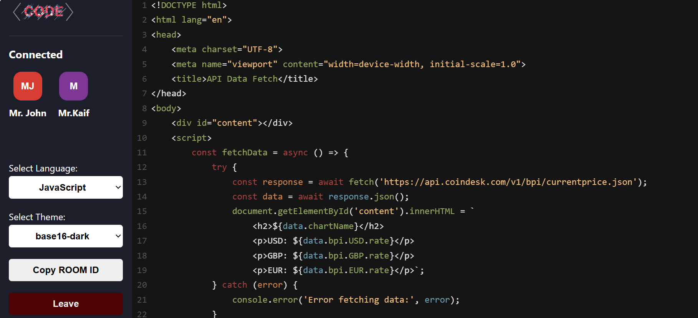

# Code Connect - A Realtime Sync Code Editor




Code Connect is a collaborative platform which enables multiple users to enter a virtual room using a unique room ID, where they can collaborate in real-time on coding projects.


## 🔮 Features

-   💻 Real-time collaboration on code editing across multiple files
-   🚀 Unique room generation with room ID for collaboration using UUID (Universally Unique Identifier)
-   🌍 Comprehensive language support for versatile programming
-   🌈 Syntax highlighting for various file types with auto-language detection
-   ⏱️ Instant updates and synchronization of code changes across all files
-   📣 Notifications for user join and leave events
-   🎩 Real-time tooltip displaying users currently editing
-   🎨 Multiple themes for personalized coding experience

## 💻 Tech Stack


## ⚙️ Installation

1. **Fork this repository:** Click the Fork button located in the top-right corner of this page to fork the repository.
2. **Clone the repository:**
    ```bash
    git clone https://github.com/<your-username>/Code-Sync.git
    ```
3. **Set .env file:**
   Inside src directory create a file names as `.env` and set the following environment variables:

    Frontend:

    ```bash
     REACT_APP_BACKEND_URL = http://localhost:5000
    ```

    Backend:

    ```bash
    PORT=3000
    ```

4. **Install dependencies:**
   Navigate to the frontend and backend directories separately and run:
    ```bash
     npm install
    ```
5. **Start the frontend and backend servers:**  
   Frontend:
    ```bash
    cd Code-co
    npm run dev
    ```
  

## 🤝 Contributing

We welcome contributions from the community! If you're interested in contributing to this project, please follow these guidelines:

- How to Contribute
- Fork the repository and clone it to your local machine.
- Create a new branch for your feature or bug fix.
- Make your changes and test thoroughly.
- Commit your changes following the commit message guidelines.
- Push your branch to your fork and submit a pull request against the main repository's develop branch.


## 🌟 Support Me

If you find this helpful or valuable, please consider 🌟 starring the repository. It helps us gain visibility and encourages further development. We appreciate your support!
